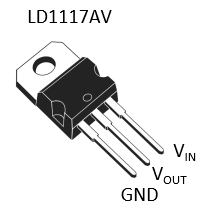
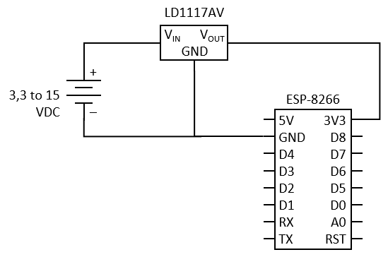

# ESP-8266 Power Supply Using LD1117AV Voltage Regulator

The ESP-8266 microcontroller can be supplied in power in several ways:

* 5 V through USB power/data port
* 5 V through 5V pin
* 3,3 V through 3V3 pin

Soon you will find that many projects require more than simply 3,3 volts: for driving motors, lighting bulbs, actioning valves, etc. In these cases, you can attach a power source of adequate voltage level and convert a small amount of power to 3,3 V for the ESP-8266. The LD1117AV is a 3,3 V regulator able to provide up to 1 A of output current and is a great choice for the ESP-8266.

The following circuit diagram explains how easy you can integrate the LD1117AV to your project.

⚠ **Warning! I do not recommend to connecting your computer through USB at same time as any 5V power source, to prevent potential damage on your computer's USB port.**
